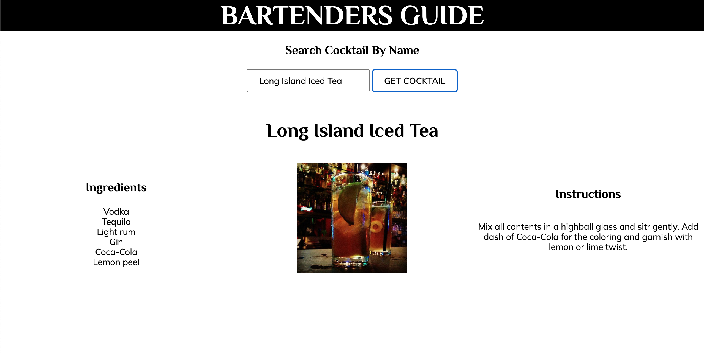
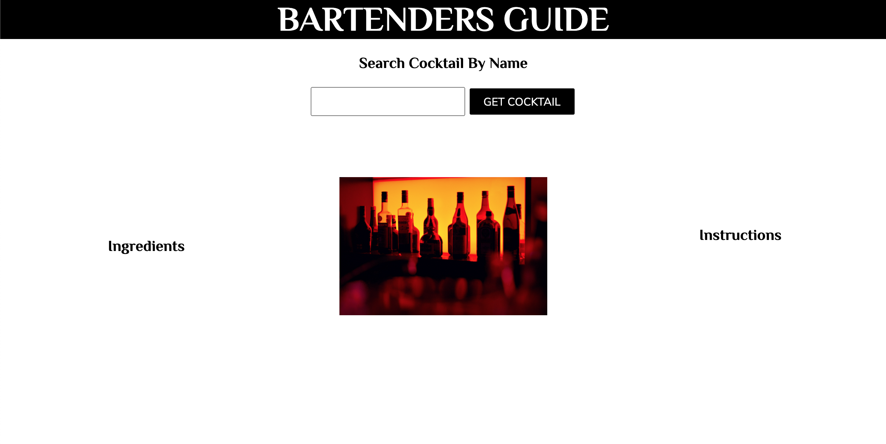

# Bartenders Guide
Search for a cocktail and get the ingredients and instructions of drink of choice. 

**Link to project:** not hosed at this time

## How It's Made:

**Tech used:** HTML, CSS, JavaScript

This bartenders guide uses The CocktailDB API JSON data. There is a search function that calls the API, the JSON message data for instructions and ingredients for the cocktail searched is inputted into the HTML.

## Lessons Learned:

Working on honing my API calling skills. There is a lot of good info out there to use, just have to be able to use it correctly.